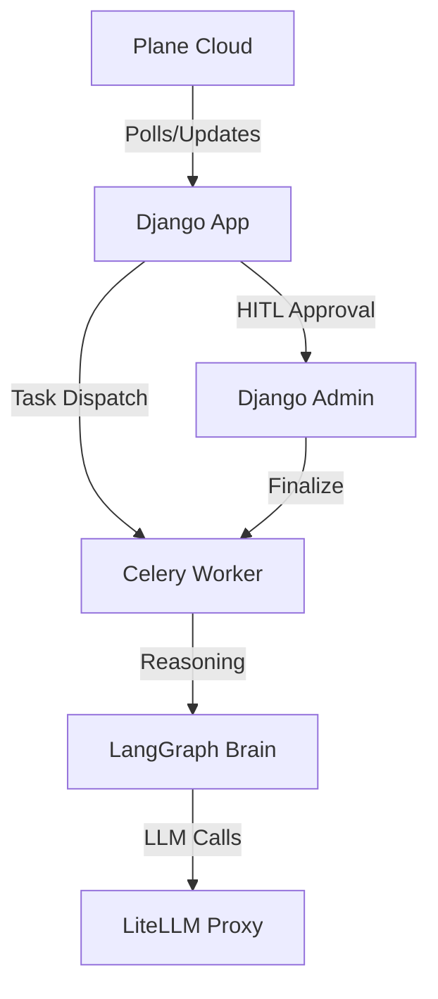

# PM Bot

An autonomous, production-grade AI agent that triages, responds to, and manages [Plane](https://app.plane.so) issues using a stateful **LangGraph** reasoning workflow, **Celery** background workers, and comprehensive observability.


## Features

- 🤖 **Autonomous Triage**: Automatically polls Plane every 5 minutes and uses LangGraph to analyze and categorize issues (BUG/FEATURE/QUESTION)
- ✍️ **Smart Response Generation**: Drafts contextual comments using LLM-powered reasoning
- 👥 **Human-in-the-Loop**: Review and approve agent-generated drafts via Django Admin before posting
- 📊 **Full Observability**: Track agent sessions, states, and decisions through the admin interface
- 🔧 **CLI Tools**: Manage and monitor your bot from the terminal

## Architecture



### Data Flow

1. **Poll**: Celery Beat periodically polls the PlaneClient for new issues
2. **Brain**: LangGraph analyzes the issue, triages it, and drafts a comment
3. **Persist**: The AgentIssueSession model records the processing state
4. **Approval**: A human reviews the draft via Django Admin
5. **Post**: Upon approval, Celery pushes the comment to Plane

## Quick Start

### Prerequisites

- Docker & Docker Compose
- `uv` Python package manager (optional, for local operations)

### Installation

```bash
# Clone the repository
git clone <repository-url>
cd pm-bot

# Copy environment configuration
cp .env.example .env

# Edit .env and add your API keys:
# - PLANE_API_TOKEN (your Plane.so API token)
# - GROQ_API_KEY (or other LLM provider key)
```

### Launch with Docker

```bash
# Build and start all services
docker compose up --build -d
```

This launches:
- `postgres-django` - PostgreSQL database (port 5432)
- `redis` - Message broker (port 6379/8005)
- `django-web` - Django admin backend (http://localhost:8002)
- `celery-worker` - Executes LLM graph operations
- `celery-beat` - Schedules periodic polling

### Initialize Database

```bash
# Run migrations
docker compose exec django-web uv run python manage.py migrate

# Create admin user
docker compose exec django-web uv run python manage.py createsuperuser
```

Access the Django Admin at **http://localhost:8002/admin**

## Usage

### CLI Commands

The project includes a `pm-bot` CLI tool for managing the agent:

```bash
# View recent agent sessions
uv run pm-bot status

# Manually trigger a poll of Plane issues
uv run pm-bot sync
```

### Human-in-the-Loop Workflow

1. The bot automatically polls Plane and drafts responses
2. Navigate to Django Admin → AgentIssueSessions
3. Review pending drafts and their suggested actions
4. Approve drafts to post comments to Plane
5. Monitor session states as they progress through the workflow

## Configuration

Key environment variables (see `.env.example`):

| Variable | Description |
|----------|-------------|
| `PLANE_API_TOKEN` | Your Plane.so API authentication token |
| `GROQ_API_KEY` | LLM provider API key for reasoning |
| `DATABASE_URL` | PostgreSQL connection string |
| `CELERY_BROKER_URL` | Redis broker URL for task queue |
| `PLANE_WEB_URL` | Base URL for your Plane instance |

See [`docs/CONFIGURATION.md`](docs/CONFIGURATION.md) for complete configuration options.

## Project Structure

```
pm-bot/
├── backend/           # Django project root
│   ├── agent/         # Agent logic and models
│   ├── authentication/# Auth handling
│   ├── chat/          # Chat functionality
│   └── integrations/  # External service integrations
├── cli/               # Command-line interface
├── deep_agent/        # LangGraph brain and Celery tasks
├── plane_client/      # Plane API client wrapper
├── docs/              # Documentation
├── docker-compose.yml # Service orchestration
└── pyproject.toml     # Project dependencies
```

## Development

### Running Tests

```bash
docker compose exec django-web uv run pytest
```

### Local Development

For detailed development setup, see [`docs/DEVELOPMENT.md`](docs/DEVELOPMENT.md).

## Documentation

- [Getting Started](docs/GETTING-STARTED.md) - Complete setup guide
- [Architecture](docs/ARCHITECTURE.md) - System design and data flow
- [Configuration](docs/CONFIGURATION.md) - Environment variables and settings
- [Deployment](docs/DEPLOYMENT.md) - Production deployment guide
- [Testing](docs/TESTING.md) - Testing strategies and examples
- [Integrations](docs/INTEGRATIONS.md) - External service integrations

## Contributing

See CONTRIBUTING.md for contribution guidelines.

## License

MIT License - See [LICENSE](LICENSE) file for details.
