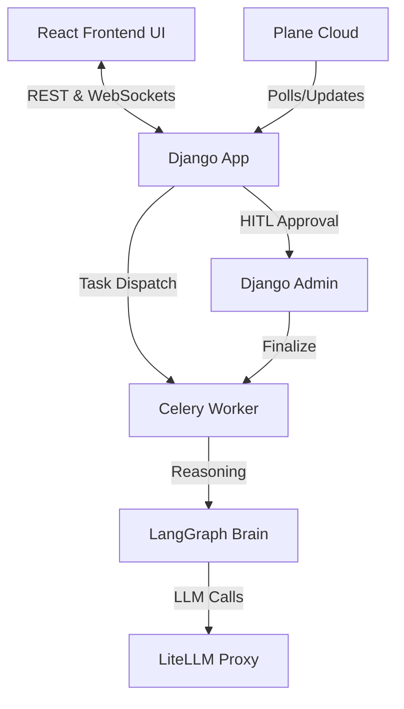

<!-- generated-by: gsd-doc-writer -->
## ARCHITECTURE.md

PM Bot is an AI-powered project management assistant that automates Plane issue triage and responses. It utilizes a stateful LangGraph reasoning workflow, managed by Celery background workers, with human-in-the-loop approval.

### Component Diagram

### Data Flow
1. **User Interaction:** The React application (`ui/`) communicates user actions to the Django backend via REST or streaming responses via WebSockets.
2. **Poll:** `Celery Beat` periodically polls the `PlaneClient` for new issues.
3. **Brain:** `LangGraph` analyzes the issue, triages it (BUG/FEATURE/QUESTION), and drafts a comment.
4. **Persist:** The `AgentIssueSession` model records the processing state.
5. **Approval:** A human reviews the draft via the Django Admin panel or custom UI interfaces.
6. **Post:** Upon approval, the `process_approved_session` Celery task pushes the comment to Plane.

### Key Abstractions
* `AgentIssueSession`: The database model tracking agent state.
* `PlaneClient`: Wrapper for all Plane.so API interactions.
* `LangGraph Brain`: 3-node sequential reasoning pipeline (`analyze`, `triage`, `generate`).

### Directory Structure Rationale
* `ui/`: Modern React Single Page Application utilizing Vite, communicating via REST and WebSockets.
* `backend/`: Django project root and core application logic exposing APIs and admin interfaces.
* `deep_agent/`: Contains the stateful agent models, tasks, and the LangGraph implementation.
* `plane_client/`: Isolated API client for Plane integration.
* `cli/`: Command-line interface for manual agent administration.
